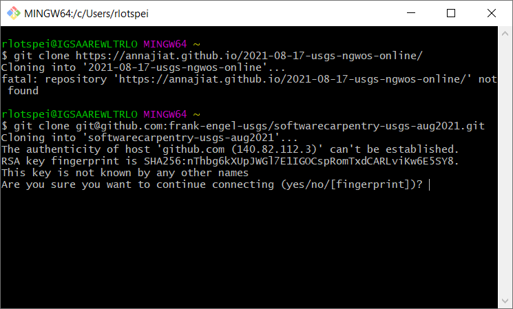
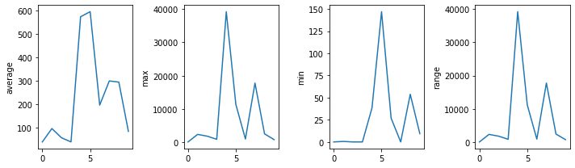
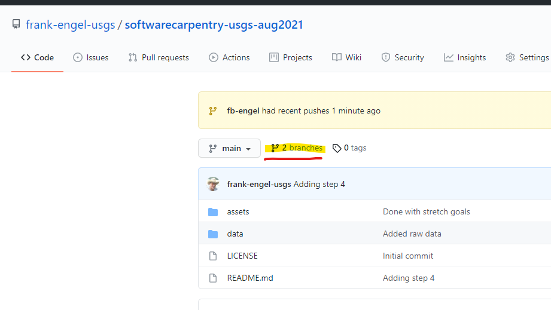
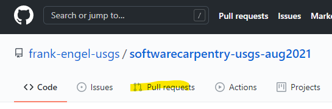
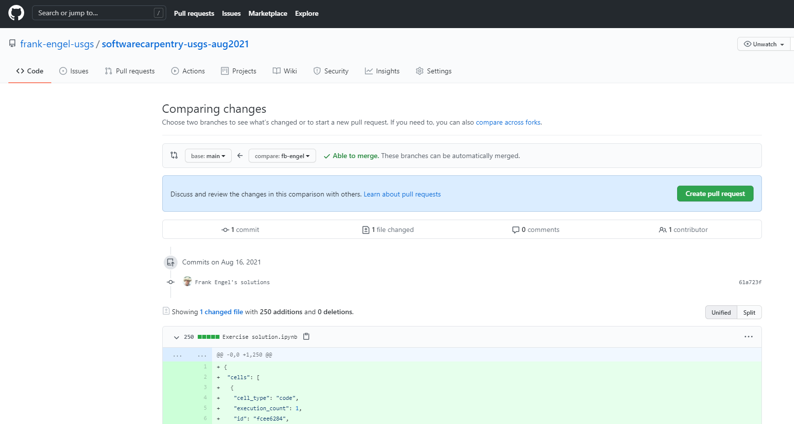
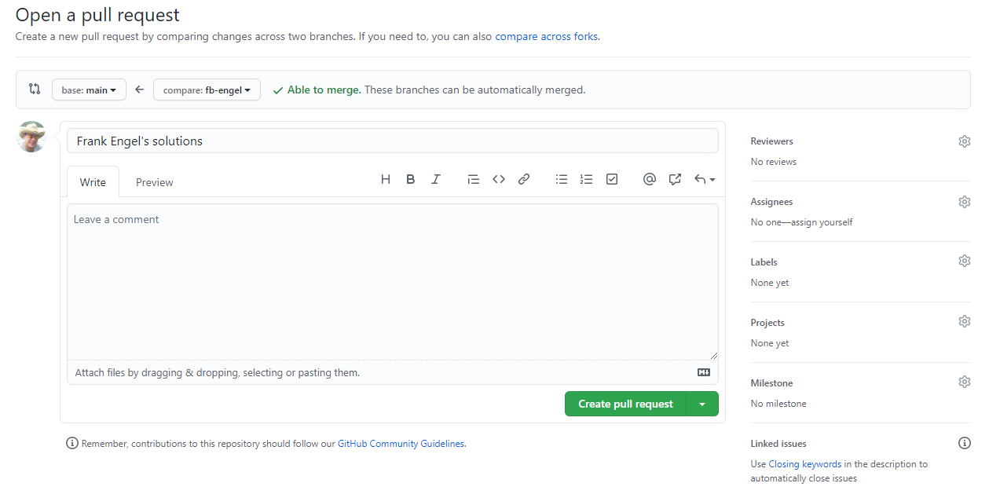
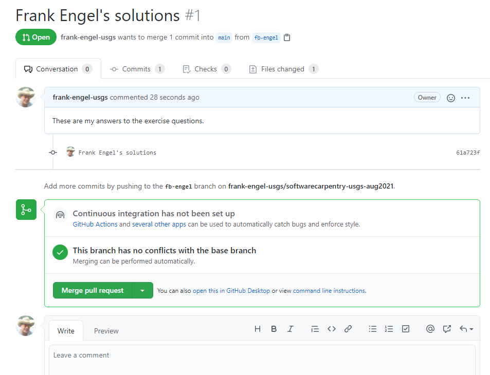
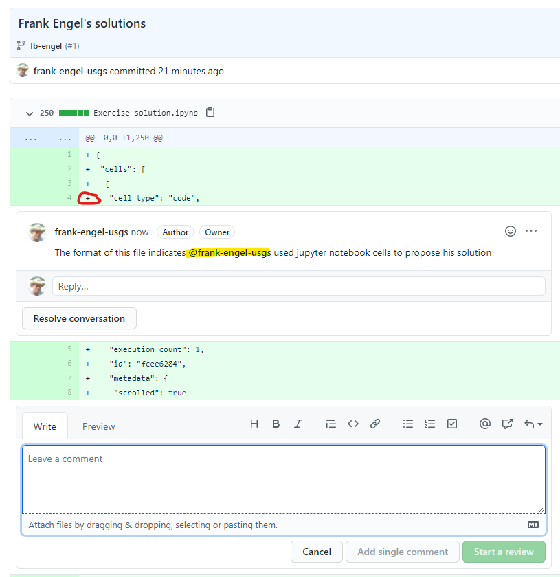
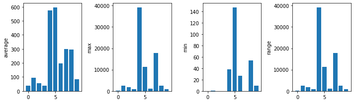
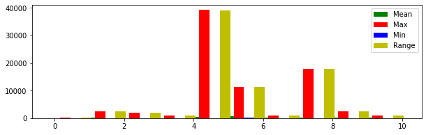

# Exercise
## Parsing and visualizing USGS Gage Data
This exercise is meant to provide some more realistic real-world practice with 
your new python coding skills by having learners load and parse  real USGS 
gage data.

## Overview
1. You will clone this repository, which contains the data and these instructions,
   to your local computer.
2. Next, you will create a local branch in which to make your code and edits.
3. Then, you will create python code to load and manipulate the supplied data.
4. Finally, you will share your results back to the repository by creating and uploading your work to a 
   remote git branch and issuing a pull request.

## Step one: Cloning this repository
Use the skills you learned during Day 1 of the 
[Software Carpentries Workshop](https://annajiat.github.io/2021-08-17-usgs-ngwos-online)
to clone this repository to your local machine. The project page for this repository is:
<https://github.com/frank-engel-usgs/softwarecarpentry-usgs-aug2021>

**Hint:** You will want to `clone` this repo using git bash or other git client. 

<details>
  <summary>Solution</summary>
  
  Open a git bash window in the location you wish your clone of the repository to live.
  Then, issue the command:

  ```bash
   git clone git@github.com:frank-engel-usgs/softwarecarpentry-usgs-aug2021.git
  ```

  Conversely, if using ssh, the command would be:
```bash
git clone https://github.com/frank-engel-usgs/softwarecarpentry-usgs-aug2021.git
```
If this is the first time you have connected to the repo, you will likley get a warning about the authenticity of the 
   repo. If you trust the repo source (Frank Engel, USGS), then you can answer yes to the prompt to continue the clone.

 
   
   Note: ssh is generally preferred practice over https for repositories in USGS.
</details>

## Step two: Create a local branch
Although not explicitly discussed in the Software Carpentries workshop, typically collaborative coding work
in git is handled through branching. There are a couple of different approaches to branching, but probably
the most popular, and certainly most used among USGS is the 
[feature branch workflow](https://www.atlassian.com/git/tutorials/comparing-workflows/feature-branch-workflow).

In this wrokflow, the `master` (or `main` if using github) branch of the repository always represents the most up-to-date and fully
functioning code. In essence, the `main` branch should be deployable code, software, or whatever is the 
focus of your collaborative work. When someone wishes to edit code to create a new feature, fix a bug, or
update documentation, they will create a branch off of the `main` in which to do any edits. This way, the main
copy of the code is always the most recent *working* copy, and any changes you do in a branch will not break
the code for any other users. 

In this step, we will create a new feature branch in your repo called `fp-<lastname>`, where `fp` is short
for "feature branch" and `<lastname>` is your name. So, for example, I would create a branch called `fb-engel`.

Let's do this for our repo. The steps are well discussed and outlined in the 
[feature branch workflow](https://www.atlassian.com/git/tutorials/comparing-workflows/feature-branch-workflow).
 article linked above. Here's a short review. 

First, make sure your repo is up to date. If you just did Step One, you should be good to go, but just in case, you can 
issue the following commands from a git bash window:

```bash
git checkout main
git fetch origin
git reset --hard origin/main
```

Technically, this is a heavy handed approach, but it ensures we are all on the same page. In practice, I typically
just do:

```bash
git fetch --all
git pull
```

The `--all` tag just ensures that my local repo copy has all of the remote branches in the repo. Another useful command
is `--prune`, which will delete local branches that are not active and/or already closed or merged in the remote 
copy of the repo. This is handy for large repos where several feature updates and/or issues have been addressed. 

Now that you have the most up to date version of the repo on your machine, you can create a new branch from the currnet
version of the `master` by (replace `engel` with your last name):

```bash
git checkout -b fb-engel
```

This will create a new branch called `fb-engel`, which is an exact copy of `main` and move you into that branch.
Your git bash should now look something like this:

```bash
fengel@IGSKIKCWLTFENG2 MINGW64 /c/REPOS/softwarecarpentry-usgs-aug2021 (main)
$ git checkout -b fb-engel
Switched to a new branch 'fb-engel'

fengel@IGSKIKCWLTFENG2 MINGW64 /c/REPOS/softwarecarpentry-usgs-aug2021 (fb-engel)
$

```

Now you are working in your own local feature branch of the code, and the `main` branch is safe! 

## Step three: create python code

Now we can work on creating the python code necessary to read the supplied data and visualize some 
USGS streamflow information. The data are in the `/data/` folder and consist of comma separated values (CSV)
tables with 10-years of daily values gage data for two streamgages. 

```bash
$ ls data/
 080167500_Guadalupe_SpringBranch_DailyMeanGH.csv
 080167500_Guadalupe_SpringBranch_DailyMeanQ.csv
 080167500_Guadalupe_SpringBranch_DailyMeanQ_GH.csv
'Discharge.Mean@02035000.csv'
```

The structure of each file is similar (but not exactly the same, so beware). Let's use `/data/080167500_Guadalupe_SpringBranch_DailyMeanQ.csv`
first. This CSV has 365 rows corresponding to day of the year, and 10 columns, corresponding the daily mean discharge (Q) per year. The data span 
2011-01-01 to 202-12-30. 

Your job is to use the skills obtained during the first half of the Software Carpentries workshop to:

1. Load the file `/data/080167500_Guadalupe_SpringBranch_DailyMeanQ.csv` into a numpy array
2. Summarize the following statistic for each year of record supplied: mean, minimum, maximum, and range
3. Plot the yearly statistics

<details>
  <summary>Solution #1</summary>
  
  Load the data using numpy. Don't forget to import necessary modules!

  ```python
%matplotlib inline
import matplotlib.pyplot
import numpy


data = numpy.loadtxt(fname='data/080167500_Guadalupe_SpringBranch_DailyMeanQ.csv', delimiter=',')
print(data)

[[123.   37.3  44.9 ...  82.3 734.   81.2]
 [117.   34.8  44.7 ...  81.8 737.   79.1]
 [115.   36.   46.9 ...  81.8 939.   79.2]
 ...
 [ 41.   41.8  52.9 ... 920.   84.7  49.1]
 [ 40.4  38.5  48.  ... 816.   82.9  48.3]
 [ 38.3  40.2  46.8 ... 775.   84.3  50.7]]
  ```

</details>

<details>
    <summary>Solution #2</summary>
  Compute the yearly statistics by recalling the `axis=` keyword funtionality in numpy. 

```python
meanQ = numpy.mean(data, axis=0)
minQ = numpy.min(data, axis=0)
maxQ = numpy.max(data, axis=0)
rangeQ = maxQ - minQ
print(meanQ)
print(minQ)
print(maxQ)
print(rangeQ)

[ 38.15153425  95.49547945  56.09271233  38.25443836 574.71616438
 596.44109589 195.93150685 299.62241096 294.57369863  83.39668493]
[  0.     0.57   0.     0.    38.4  147.    26.8    0.    53.8    9.35]
[  159.  2420.  1890.   955. 39200. 11400.  1030. 17800.  2580.   856.]
[  159.    2419.43  1890.     955.   39161.6  11253.    1003.2  17800.
  2526.2    846.65]
```
 A note for the observant. We use "rangeQ" etc as variable names becasue `min`, `max`, and 
`range` are also python functions. Naming variables after exisitng python functions can cause issues later.

</details>

<details>
    <summary>Solution #3</summary>
   Make a plot of the yearly statistics using matplotlib and numpy.

```python
fig = matplotlib.pyplot.figure(figsize=(10.0, 3.0))

axes1 = fig.add_subplot(1, 4, 1)
axes2 = fig.add_subplot(1, 4, 2)
axes3 = fig.add_subplot(1, 4, 3)
axes4 = fig.add_subplot(1, 4, 4)

axes1.set_ylabel('average')
axes1.plot(numpy.mean(data, axis=0))

axes2.set_ylabel('max')
axes2.plot(numpy.max(data, axis=0))

axes3.set_ylabel('min')
axes3.plot(numpy.min(data, axis=0))

axes4.set_ylabel('range')
axes4.plot(numpy.max(data, axis=0) - numpy.min(data, axis=0))

fig.tight_layout()
matplotlib.pyplot.show()
```



</details>

## Step four: Share your results

Finally, now that you have a working solution to Steps 1–3, you are ready to share your results with everyone else. 
To do this, we will push your local results (contained in `fb-<lastname>`) up to the main repository, and then
create a "pull request" (in GitLab, which USGS uses, this is called a *merge request*, but otherwise the steps are 
pretty much identical). 

To reconcile local changes and sync them to the remote repository, we use the `push` command. This command will transfer
commits you've made to a branch up to the server so others can inspect, and ultimated once your change is "approved"
enable merging of the change into the master (or main) branch. The format for this from a git bash console is
pretty simple:

```bash
git push <remote> <origin>
```

In our case however, we also have to tell git to create the connection between your local branch (`fb-<lastname>`)
and the remote repository using the `--set-upstream` switch. So, to push your work, you'll need to do:

```bash
git push --set-upstream origin fb-engel
```
*be sure to use your branch name here.*

This will prompt you to provide ssh credentials, and then will upload the results. You can check that your branch was
successsfully upload over at the [Project page](https://github.com/frank-engel-usgs/softwarecarpentry-usgs-aug2021) by
clicking on the branches icon:
.

### Creating a Pull Request
The real power of git is in protecting collaboratively worked on code. As we've already discussed, the master (or main)
branch is always "clean", and is supposed to be ready to deploy. Work that you do on a collaborative coding 
project is done in a *feature branch workflow*. Once you've written your code and have your new feauture, bug, 
or issue solved, typically you will want someone on your team to review it to ensure it doesn't break anything
and actually fixes/does what is expected. The mechanism for this review process is called *pull request* (in GitLab
it is called a *merge request*, but same concept). You can read a lot more about pull requests in this [Atlassian article](https://www.atlassian.com/git/tutorials/making-a-pull-request).

Now we will create a pull request on your newly uploaded branch. First, head on over to the Project Page if you 
don't already have it up:
<https://github.com/frank-engel-usgs/softwarecarpentry-usgs-aug2021>

Click on "Pull Requests" near the top:


Then click on "New Pull Request". You may see a banner message about your new branch, with something like "Compare & Pull Request".
You can use that link too, and git is smart enough to know that's typically what you want to do. But "New Pull Request" is how 
we will do it here to ensure you get practice with the full workflow. 

Github will then ask you which branches to compare. In our case the base is `main`, and the compare is `fb-engel` (or your branch).


This will create the framework of the pull/merge, with a nice mechanism for comparing changes made with new files, or even changes 
to existing file. Take a look to see what it did, and when satisfied, click the "Create Pull Request" button. 
.

The final step is to provide some comments and documentation about the pull request. Typically, here you can assign
reviewers or labels, or other project tracking metrics. For now, just enter a simple comment about what you did, and
then click "Create Pull Request". 


This will create the pull request, and notify any developers on the team (or identified reviewers) that you made
a request. This page is now ready for other to review the changes you made to the code in an interactive
manner. 


Typically, the main developers will look at your code, and provide feedback either in comments at the Pull Request
level, or even on specific lines of code. For example, anyone can add comment to particular lines of code if there
is something needing attention there:
.

Once satisfied, a developer can approve the request, and changes will be merged back into the master/main branch. 


## Stretch Goals
Although beyond the skills that you have learned so far in the Software Carpentries workshop, there are some 
interesting stretch goals you can attempt if you want. Solutions to the first 3 stretch goals are given below.
1. Make a nicer print statement for the statistics printout using the `.format` approach.
2. Change the plot style to a tight sub-plot of bar graphs rather than the line graphs
3. Better yet, make a grouped bar graph of the results by year.
4. Parse the other files, noticing that the format is different for some of them (e.g., the `Discharge.Mean@02035000.csv`
   file contains a index of each day in the first columm, and `080167500_Guadalupe_SpringBranch_DailyMeanQ_GH.csv`
   is has 20 columns, corresponding to Q & GH per year).

<details>
    <summary>Solution #1</summary>

We can use the format functionality in python 3 to create a little more of a readable output of the statistics
we calculated above. The new [format string](https://docs.python.org/3/library/string.html#format-string-syntax)
syntax is very powerful. This solution just shows a small snippet of some possibilities. Combining this with
[list comprehension](https://python-3-patterns-idioms-test.readthedocs.io/en/latest/Comprehensions.html) gives a more meaning way to display the data. 

```python
print('\n\nYearly statistics for 080167500:')
print('Average flow:')
print(['{:.2f}'.format(item) for item in meanQ])
print('\nMin flow:')
print(['{:.2f}'.format(item) for item in minQ])
print('\nMax flow:')
print(['{:.2f}'.format(item) for item in maxQ])
print('\nRange:')
print(['{:.2f}'.format(item) for item in rangeQ])

Yearly statistics for 080167500:
Average flow:
['38.15', '95.50', '56.09', '38.25', '574.72', '596.44', '195.93', '299.62', '294.57', '83.40']

Min flow:
['0.00', '0.57', '0.00', '0.00', '38.40', '147.00', '26.80', '0.00', '53.80', '9.35']

Max flow:
['159.00', '2420.00', '1890.00', '955.00', '39200.00', '11400.00', '1030.00', '17800.00', '2580.00', '856.00']

Range:
['159.00', '2419.43', '1890.00', '955.00', '39161.60', '11253.00', '1003.20', '17800.00', '2526.20', '846.65']
```

Ultimately, if we *really* wanted a better visualization of the tabular data here, I'd recommend we do our processing 
in [pandas](https://pandas.pydata.org/pandas-docs/stable/), but that is beyond the scope of this exercise.

</details>

<details>
    <summary>Solution #2</summary>

The data we visualized before really are not that appropriate for line charts. A better visualization would be 
bar graphs. We can do this using matplotlib's built in `pyplot.bar` class ([see the docs](https://matplotlib.org/stable/api/_as_gen/matplotlib.pyplot.bar.html)). 
To represent the x-axis, we need a float or array-like variable representing the x coordinates of the bar.
For now, we can just use `range` to accomplish this, but there are ways to improve on this solution.

```python
fig = matplotlib.pyplot.figure(figsize=(10.0, 3.0))

axes1 = fig.add_subplot(1, 4, 1)
axes2 = fig.add_subplot(1, 4, 2)
axes3 = fig.add_subplot(1, 4, 3)
axes4 = fig.add_subplot(1, 4, 4)

x = range(10)

axes1.set_ylabel('average')
axes1.bar(x, numpy.mean(data, axis=0))

axes2.set_ylabel('max')
axes2.bar(x, numpy.max(data, axis=0))

axes3.set_ylabel('min')
axes3.bar(x, numpy.min(data, axis=0))

axes4.set_ylabel('range')
axes4.bar(x, numpy.max(data, axis=0) - numpy.min(data, axis=0))

fig.tight_layout()

matplotlib.pyplot.show()
```



</details>

<details>
    <summary>Solution #3</summary>

Here we can use some tricks in the matplotlib's built in `pyplot.bar` class ([see the docs](https://matplotlib.org/stable/api/_as_gen/matplotlib.pyplot.bar.html))
to allow us to plot multiple bars under one x location to create a grouped bar chart. This is a fast solution.
It should be noted there are more complete (and pretty) solutions you can create. 

```python
fig = matplotlib.pyplot.figure(figsize=(10.0, 3.0))
axes = fig.add_subplot()

x = numpy.arange(data.shape[1]) # This time using a more generalizable approach
                                # by pulling the shape of data and creating an array

bar_width = 0.3
bar1 = axes.bar(x, numpy.mean(data, axis=0), width=bar_width, color='g')
bar2 = axes.bar(x + bar_width, numpy.max(data, axis=0), width=bar_width, color='r')
bar3 = axes.bar(x + bar_width*2, numpy.min(data, axis=0), width=bar_width,  color='b')
bar4 = axes.bar(x + bar_width*3, numpy.max(data, axis=0) - numpy.min(data, axis=0), width=bar_width,  color='y')

# Fix the x-axes.
axes.legend( (bar1, bar2, bar3, bar4), ('Mean', 'Max', 'Min', 'Range') )
matplotlib.pyplot.show()

```



</details>
